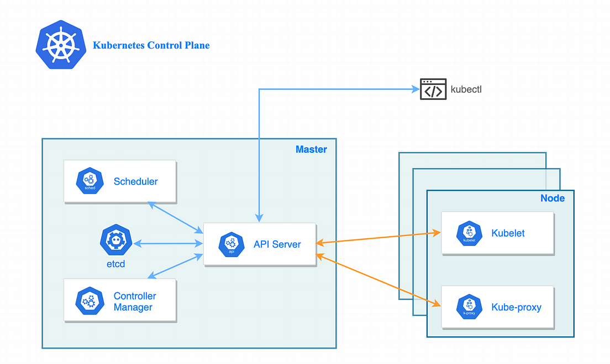

# k8s 아키텍쳐

## 시작하며

안녕하세요. 머니코어제휴서비스팀에서 개발하고 있는 손현준입니다. 쿠버네티스를 사용하면서 이런 궁금증이 들었던 적이 있으신가요? 
"내 어플리케이션이 쿠버네티스에서 실행되는데 내부적으로 어떻게 동작하는거지?". 
개발자는 보통 DevOps 팀에서 구축해준 쿠버네티스를 사용하는 경우가 많습니다. 그러다보면 내 애플리케이션이 쿠버네티스에서 실행될 때에 내부적으로 어떻게 동작하는지는 알기 어렵습니다. 
그래서 이 갈증을 해소하기 위해 글을 작성해봤습니다. 평소에 쿠버네티스를 밀접하게 사용하지만 내부적으로 어떻게 동작하는지 궁금하셨던 분들에게 도움이 되면 좋겠습니다.

## 쿠버네티스의 핵심, 컨트롤 플레인의 2가지 특징


쿠버네티스의 핵심은 컨트롤 플레인입니다. 마스터노드라고도 불립니다. 컨트롤 플레인에서 쿠버네티스의 모든 데이터를 관리하며 중요 컴포넌트들이 존재합니다. 
컨트롤 플레인은 핵심적으로 2가지 특징으로 구성되어 있습니다. 각 특징에 대해서 하나씩 설명하겠습니다. 이후 컨트롤 플레인의 특징을 쿠버네티스의 특징으로 표현하겠습니다.
- Hub and Spoke 패턴 
- 선언적 동작 방식

## 쿠버네티스 특징을 먼저 비유를 통해 알아보자

이해를 돕기 위해 비유를 통해서 2가지 특징을 설명하겠습니다. 쿠버네티스에게 내 애플리케이션을 실행시키는 플로우를 레스토랑 주문하는 상황에 빗대보겠습니다.
레스토랑에는 주문을 받는 웨이터와 요리사들이 있습니다. 
이 레스토랑에서는 **모든 대화는 웨이터를 통해서만 할 수 있으며 요리사들끼리 대화를 할 수 없습니다.** 그리고 **손님이 주문한 메뉴는 무조건 완성한다**는 서비스 정신도 투철합니다.
요리사들은 각자의 역할이 정해져있습니다. 1번째 요리사는 조리만 담당합니다. 2번째 요리사는 마지막 가니싱을 담당합니다. 

제가 파스타 2개를 먹고 싶어서 웨이터에게 주문서를 전달했습니다.

```
menu : pasta
count : 2
```

주문서를 받은 웨이터는 까먹지 않게 메모장에 주문을 기록합니다. 이후 웨이터는 1번째 요리사에게 주문서가 들어왔다고 알려줍니다. 1번째 요리사는 자신의 역할인 파스타 2개를 조리합니다. 
이 때 2번째 요리사는 자신의 역할이 아니니 대기 중입니다. 1번째 요리사가 조리가 끝나면 웨이터에게 알려줍니다. 
웨이터는 주문서에 파스타의 상태를 변경합니다. 

```
menu : pasta
count : 2
status : 조리 완료
```

이제 웨이터는 2번째 요리사에게 조리가 끝났다고 알려줍니다. 2번째 요리사는 파스타에 치즈나 파슬리를 뿌리고 웨이터에게 알려줍니다. 
웨이터는 주문서에 파스타의 상태를 변경합니다.

```
menu : pasta
count : 2
status : 가니싱 완료
```

전체적인 흐름은 아래와 같습니다.


앞서 말씀드린대로 이 레스토랑의 독특한 특징은 **"웨이터를 통해서만 대화가 진행된다"** 와 **"레스토랑은 손님의 주문을 어떻게서든 완성한다"** 입니다. 
그리고 이 2가지 특징은 쿠버네티스의 특징이기도 합니다.

## "웨이터를 통해서만 대화가 진행된다"
요리사끼리 대화하며 요리를 진행하는 방식이 아닙니다. 웨이터를 통해서 주문서를 받고 자신이 역할을 수행할 단계인지 확인합니다. 
자신의 역할이 마무리되면 웨이터에게 알려줍니다. 쿠버네티스도 마찬가지로 이 대화 방식을 사용합니다. 이를 Hub and spoke 패턴이라고 합니다.  

## "레스토랑은 손님의 주문을 어떻게서든 완성한다"
손님은 원하는 메뉴를 주문만 할 뿐입니다. 그 주문을 완성하는 건 레스토랑의 역할입니다. 
손님이 파스타 2개를 주문했다면 레스토랑은 정확히 2개를 요리해 제공해야 합니다. 만약 요리 중 파스타 1개를 바닥에 쏟았더라도 레스토랑은 다시 요리해서 손님이 원하는 2개의 파스타를 완성해야 합니다. 
쿠버네티스도 마찬가지로 이 동작 방식을 사용하며, 이를 선언적 방식이라고 합니다. **사용자는 원하는 상태를 전달하고 쿠버네티스는 그 상태를 맞추기 위해 노력하는 방식입니다.**

레스토랑 비유를 통해서 쿠버네티스의 2가지 특징을 간접적으로 이해할 수 있었습니다. 
- "웨이터를 통해서만 대화가 진행된다" -> Hub and spoke 패턴
- "레스토랑은 손님의 주문을 어떻게서든 완성한다" -> 선언적 동작 방식
 
이제 본격적으로 쿠버네티스의 이 2가지 특징을 설명하겠습니다. 

## k8s의 hub-and-spoke 패턴
앞서 설명한 레스토랑의 웨이터는 허브로, 요리사들은 스포크라는 용어로 변경해 설명하겠습니다.
허브앤스포크 패턴은 자전거 바퀴를 생각하시면 됩니다. 중앙에 허브가 존재하고 각 스포크는 허브와 연결되어 있습니다. 
각 스포크는 허브를 통해서만 연결이 유지되며 허브없이 독립적으로 연결이 되어 있지 않습니다.


이 패턴의 특징을 기억하면서 쿠버네티스는 허브앤스포크 패턴을 어떻게 적용했는지 살펴보겠습니다.



위 그림 속에서 허브 역할을 하는 컴포넌트는 API Server입니다. api server 주변에 있는 컴포넌트들은 서로 직접 통신하지 않습니다. 항상 api server와 통신을 하는 구조입니다. 
각 컴포넌트는 서로의 존재를 알지 못하며 api server와 통신하며 본인의 역할을 수행합니다.

### 허브앤스포크 패턴의 장점

- 데이터 일관성 : 쿠버네티스의 데이터를 보관하는 곳은 etcd라는 저장소 한 곳이며 api server를 통해서만 데이터의 변경이 가능하기 때문에 데이터의 일관성이 유지될 수 있습니다.

- 확장성: 새 기능이 추가되어 새로운 스포크를 추가하는 것이 용이합니다. 허브에만 연결하면 되므로 전체 구조의 변경 없이도 확장이 가능합니다

## k8s의 선언적 구조

"손님이 한 주문을 레스토랑은 어떻게서든 완성한다"는 레스토랑 비유에서 배웠던 중요한 특징 중 하나입니다. 
손님은 레스토랑이 어떤 노력을 하는지는 알 필요없습니다. 단지 내가 원했던 주문이 완성되느냐가 궁금할 뿐입니다. 

만약, 파스타 2개를 주문했는데 요리 중에 파스타 1개를 바닥에 흘렸다면, 레스토랑은 다시 1개를 새롭게 만들겠죠. 주문서에는 파스타가 2개가 적혀있기 때문입니다. 

쿠버네티스도 사용자가 원하는 상태를 달성하기 위해서 내부적으로 노력합니다. 가끔 내 팟이 수십번 재시작하는 상황을 경험한 적 있지 않으신가요?

// TODO(jack.comeback-제휴적금) : 팟 재시작하는 사진 추가

이유는 바로 쿠버네티스는 사용자가 원하는 팟의 개수를 맞추기 위해 노력하기 때문입니다. 사용자가 팟을 2개 요청했는데 어떤 이슈로 1개만 실행 성공했다면, 쿠버네티스는 요청한 개수를 맞추기 위해 나머지 1개를 끊임없이 재시도합니다. 
마치, 바닥에 흘린 파스타를 그대로 내볼 수 없고 새로 만드는 것처럼 말이죠. 

### 선언적 구조와 반대 개념 : 명령적 구조 
더 나은 이해를 위해 반대되는 개념인 명령적 구조를 설명해보겠습니다. 명령적 방식은 손님이 직접 레스토랑에 파스타를 만들기 위한 명령을 적어 제공하는 방식입니다. 
마치 아래처럼 여러 명령이 담긴 레시피를 레스토랑에 전달합니다. 

```
- 파스타면은 끓는 물에 10분 동안 삶는다
- 삶은 면을 이탈리아산 토마토 소스에 섞는다. 
- 등등.. 
```


반면에, 선언적 방식에서 손님은 원하는 주문서를 레스토랑에 전달하고 원하는 결과를 기다릴 뿐이죠. 

선언적 방식과 명령적 방식은 각기 장점이 존재합니다.
- 선언적 방식에서 손님은 원하는 상태를 전달하고 편안하게 결과를 기다리면 됩니다.
- 명령적 방식에서는 손님은 자신의 요리를 주도적으로 만들어서 먹을 수 있다는 점이죠.

### 쿠버네티스에게 전달하는 주문서 : 매니패스토 파일 

쿠버네티스는 선언적 방식을 선택했고 사용자가 원하는 상태를 달성하기 위해 노력합니다. 
이 때, 사용자가 원하는 상태를 적는 파일을 매니패스토 파일이라고 합니다. 레스토랑의 주문서와 같은 역할입니다.

```yaml
# my-app.yaml

kind: Deployment // 원하는 객체 종류
metadata:
  name: my-spring-app // 이름
spec:
  replicas: 3 // 개수
```

사용자는 위와 같은 매니패스토 파일을 쿠버네티스에게 전달합니다. 마치 이렇게 말하는 거죠. "나는 Deployment라는 객체를 원해. 이름은 my-app으로 할거야. 그 개수는 3개로 해줘"

사용자는 단지 원하는 상태를 전달하면 쿠버네티스는 내부적으로 그 상태를 맞추기 위해 노력합니다.

# Hub and spoke 패턴과 선언적 구조를 완성시키는 방법 : Watch 매커니즘 

## [watch 매커니즘](https://kubernetes.io/docs/reference/using-api/api-concepts/#efficient-detection-of-changes)

지금까지 쿠버네티스의 2가지 특징에 대해서 알아봤습니다. 이 특징을 구현하기 위해 쿠버네티스는 watch 매커니즘을 이용했습니다.
watch 매커니즘은 단어의 의미대로 누군가 쿠버네티스의 상태 변화를 실시간으로 지켜보고 있다는 의미입니다. 여기서 누군가는 컨트롤러 매니저, 스케쥴러 등 마스터 노드에 있는 컴포넌트를 의미합니다.

이 메커니즘은 컴포넌트가 API 서버에 요청하여 특정 매니패스토의 변경 사항을 스트리밍 방식으로 수신할 수 있도록 합니다. 
API 서버는 매니패스토의 생성, 수정, 삭제 등 모든 이벤트를 컴포넌트에 전달합니다


### Watch 매커니즘과 Hub and Spoke 패턴과의 관계

허브앤스포크 패턴은 "모든 통신은 API 서버를 통해서 한다"는 의미입니다. 
마스터노드 내 모든 컴포넌트는 API 서버에게 watch 요청을 보내 변경 사항을 알려달라고 말합니다. 
그러면 API 서버는 매니패스토의 변경사항이 발생하면 스트리밍 방식으로 컴포넌트에게 전달합니다.  

- **API 서버의 역할**: API 서버는 허브로서 클러스터의 모든 상태 정보를 관리합니다. 컴포넌트의 `watch` 요청을 수신하며 API 서버는 쿠버네티스 내 모든 매니패스토의 변경 사항을 전달한다.

- **컴포넌트 역할**: API 서버에게 watch 요청을 보내 변경사항을 받을 준비를 합니다. 변경사항이 전달되면 각 컴포넌트가 해야할 역할을 수행합니다. 

### Watch 매커니즘과 선언적 구조와의 관계

선언적 구조는 "쿠버네티스는 사용자가 원하는 상태는 무조건 맞추기 위해 노력한다"는 의미입니다.
이를 위해선 현재 쿠버네티스의 상태와 사용자가 원하는 상태가 일치하는지 수시로 체크해야 합니다.

- **상태 일치하는지 체크**: 사용자는 매니페스트 파일을 통해 원하는 상태를 전달합니다. 컴포넌트는 `watch` 매커니즘을 통해 변경사항을 수시로 전달받고 이 목표 상태와 현재 상태 간의 차이를 확인합니다.

- **상태 일치시키기 위해 노력**: 현재 상태가 사용자의 원하는 상태와 일치하지 않을 경우, 컴포넌트는 자동으로 조치를 취하여 상태를 조정합니다.
