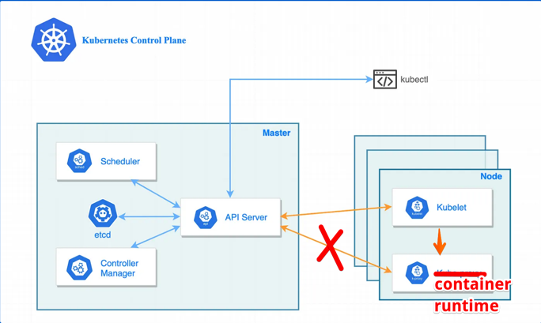
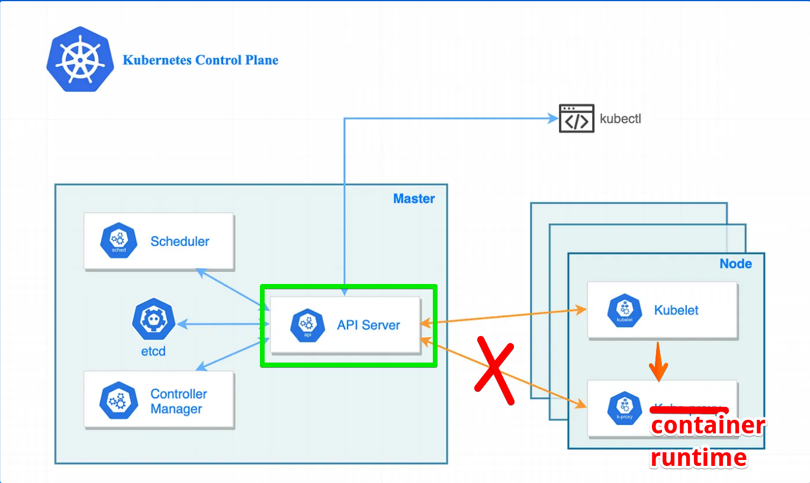

# 내 애플리케이션이 실행될 때 쿠버네티스에서 일어나는 일

## 시작하며

안녕하세요. 머니코어제휴파티 손현준입니다. 
지금까지 쿠버네티스의 2가지 특징인 "Hub and spoke 패턴"과 "선언적 동작 방식"에 대해서 알아봤습니다. 
이제는 쿠버네티스 내부에서 중요한 역할을 담당하는 컴포넌트들을 소개하겠습니다. 



API server를 중심으로 여러 컴포넌트를 나열하자면 이렇습니다.

- API server 
- etcd
- controller manager
- scheduler
- kubelet
- container runtime

하지만 이 주인공들을 다짜고짜 설명하면 지루하고 이해가 어려울 것 같습니다.  
그래서 **내 애플리케이션이 쿠버네티스에서 배포되는 실제 사례** 에서 이 주인공들이 어떤 역할을 하는지 살펴보겠습니다.

### 어플리케이션 배포를 위한 매니패스토 파일

이전 글에서는 쿠버네티스를 레스토랑에 비유했습니다. 이 때 레스토랑에게 전달하는 주문서가 필요하고 쿠버네티스에서는 이를 매니패스토 파일이라 불렀습니다. 
저의 어플리케이션 배포를 위해 쿠버네티스에게 전달하는 매니패스토 파일을 보겠습니다.

```yaml
# my-app.yaml

kind: Deployment # 종류
metadata:
  name: myapp # 이름
spec:
  replicas: 3 # 개수
  template:
    spec:
      containers:
        - name: nginx
          image: nginx:1.21.6 # 컨테이너 이미지
          ports:
            - containerPort: 80
```

이 매니패스토 파일은 제가 원하는 상태가 적혔고, 저는 쿠버네티스에게 이렇게 말하고 있습니다. 
> 내 어플리케이션을 배포하려고해. Deployment라는 객체를 사용할거고 
> 그 내부에 컨테이너의 개수는 3개로 할거야. 
> 그리고 컨테이너의 이미지는 nginx를 사용할거야

### 쿠버네티스와 대화하는 도구 : kubectl

매니패스토 파일을 쿠버네티스에게 전달하기 위해서는 kubectl이라는 도구를 이용해야 합니다. 제 매니패스토 파일을 전달해보겠습니다.

```
kubectl apply -f my-app.yaml
```

kubectl은 내부적으로 HTTP 통신으로 my-app.yaml을 쿠버네티스에게 전달합니다. 실제 HTTP 통신을 하는지 보고 싶다면 `-v=8`을 붙이면 됩니다. 

- 명령어 
```
kubectl apply -f my-app.yaml -v=8
```

- 예시 결과

```yaml
I0827 06:51:49.950850    8021 loader.go:375] Config loaded from file:  /home/user/.kube/config
I0827 06:51:49.954797    8021 round_trippers.go:420] POST https://example.com:6443/api/v1/namespaces/default/pods
I0827 06:51:49.954817    8021 round_trippers.go:427] Request Headers:
I0827 06:51:49.954821    8021 round_trippers.go:431]     Accept: application/json
I0827 06:51:49.954826    8021 round_trippers.go:431]     Content-Type: application/json
I0827 06:51:49.954831    8021 round_trippers.go:431]     User-Agent: kubectl/v1.19.0 (linux/amd64) kubernetes/e199641
I0827 06:51:49.954831    8021 round_trippers.go:431]     Authorization: Bearer <masked>
I0827 06:51:50.141125    8021 round_trippers.go:446] Response Status: 201 Created in 186 milliseconds
I0827 06:51:50.141185    8021 round_trippers.go:449] Response Headers:
I0827 06:51:50.141197    8021 round_trippers.go:452]     Content-Type: application/json
I0827 06:51:50.141214    8021 round_trippers.go:452]     Date: Fri, 27 Aug 2021 10:51:50 GMT
```

## 배포 주문을 받은 API server  

저는 배포를 원한다는 걸 쿠버네티스에게 전달했습니다. 실제 내부에서 이 요청을 받는 컴포넌트는 API server 입니다. 
Hub and spoke 패턴에 기반해 API server는 모든 통신의 허브 역할을 합니다.



저에게 매니패스토 파일을 전달받은 API server는 해당 정보를 etcd 저장소에 저장합니다. 

etcd는 쿠버네티스와 관련된 모든 데이터를 저장하는 장소입니다. key-value 형식의 저장소입니다. 

```yaml
"/registry/deployments/default/myapp":
  {
    "kind": "Deployment",
    "metadata": {
      "name": "myapp",
      "namespace": "default",
      "labels": {
        "app": "myapp"
      }
    },
    "spec": {
      "replicas": 3,
      "template": {
        "spec": {
          "containers": [
            {
              "name": "nginx",
              "image": "nginx:1.21.6"
            }
          ]
        }
      }
    }
  }
  


```

## 필요한 객체를 생성하는 컨트롤러 매니저 

API server가 etcd에 Deployment 객체를 저장했습니다. 이 사실을 `watch 매커니즘`으로 지켜보고 있던 컨트롤러 매니저에게 전달합니다. 

Deployment 객체가 생성됐다는 사실을 전달받은 컨트롤러 매니저는 ReplicaSet, Pod 객체를 생성합니다. 

여기서 ReplicaSet, Pod 객체를 생성한다는 건 API server에게 etcd에 저장해달라고 요청하는 상황을 말합니다. 

그럼 etcd에는 새로 생성된 객체가 저장됩니다. 

```json
{
  "kind": "ReplicaSet",
  "metadata": {
    "name": "myapp-replicaset",
    "namespace": "default",
    "labels": {
      "app": "myapp"
    }
  },
  "spec": {
    "replicas": 3,
    "selector": {
      "matchLabels": {
        "app": "myapp"
      }
    },
    "template": {
      "metadata": {
        "labels": {
          "app": "myapp"
        }
      },
      "spec": {
        "containers": [
          {
            "name": "nginx",
            "image": "nginx:1.21.6"
          }
        ]
      }
    }
  }
}

```

// TODO(jack.comeback-제휴적금) : pod yaml에 status 추가하기

```json
{
  "kind": "Pod",
  "metadata": {
    "name": "myapp-pod-12345",
    "namespace": "default",
    "labels": {
      "app": "myapp"
    }
  },
  "spec": {
    "containers": [
      {
        "name": "nginx",
        "image": "nginx:1.21.6"
      }
    ]
  }
}

```

## 팟이 생성되면 어떤 노드에서 실행할지 결정하는 스케쥴러 

팟이 생성되면 API server는 이 사실을 스케쥴러에게 전달합니다. 스케쥴러는 이 팟이 어떤 노드에서 실행될지 결정합니다. 
이 때는 필터링과 스코어링이라는 과정을 수행합니다. 

- 필터링: 스케줄러는 Pod의 요구사항을 충족할 수 없는 노드를 제외하고, 가능한 노드 목록을 생성합니다.
- 스코어링: 필터링을 통과한 노드들에 점수를 부여하여 가장 적합한 노드를 선택합니다. 점수를 매긴다.

스케줄러는 가장 높은 점수를 받은 노드를 선택하여 Pod 객체에 할당하고, 이를 etcd에 업데이트합니다. 이 과정에서 Pod 객체는 특정 노드에 할당된 상태가 됩니다

- before : 노드 미배정

```
{
  "kind": "Pod",
  "apiVersion": "v1",
  "metadata": {
    "name": "myapp-pod-12345",
    "namespace": "default",
    "uid": "pod-unique-id",
    "labels": {
      "app": "myapp"
    }
  },
  "spec": {
    "containers": [
      {
        "name": "nginx",
        "image": "nginx:1.21.6",
        "ports": [
          {
            "containerPort": 80
          }
        ]
      }
    ]
  },
  "status": {
    "phase": "Pending",
  }
}

```

- after : 노드가 배정됨
```
{
  "kind": "Pod",
  "apiVersion": "v1",
  "metadata": {
    "name": "myapp-pod-12345",
    "namespace": "default",
    "uid": "pod-unique-id",
    "labels": {
      "app": "myapp"
    }
  },
  "spec": {
    "nodeName": "node-1",  // 노드 배정
    "containers": [
      {
        "name": "nginx",
        "image": "nginx:1.21.6",
        "ports": [
          {
            "containerPort": 80
          }
        ]
      }
    ]
  },
  "status": {
    "phase": "Pending",
  }
}

```


## 실행할 노드가 정해진 팟은 kubelet이 실제로 프로세스로 실행한다. 

팟에 노드가 지정됐다는 변경사항을 API server가 kubelet에게 전달합니다. 
그러면 kubelet은 전달받은 팟의 정보를 기반으로 container runtime에게 컨테이너 생성을 요청합니다.


## 전체 플로우

// TODO(jack.comeback-제휴적금) : 위에서 설명한 플로우 그림으로 추가하기


