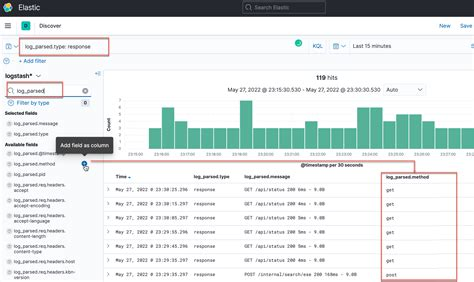
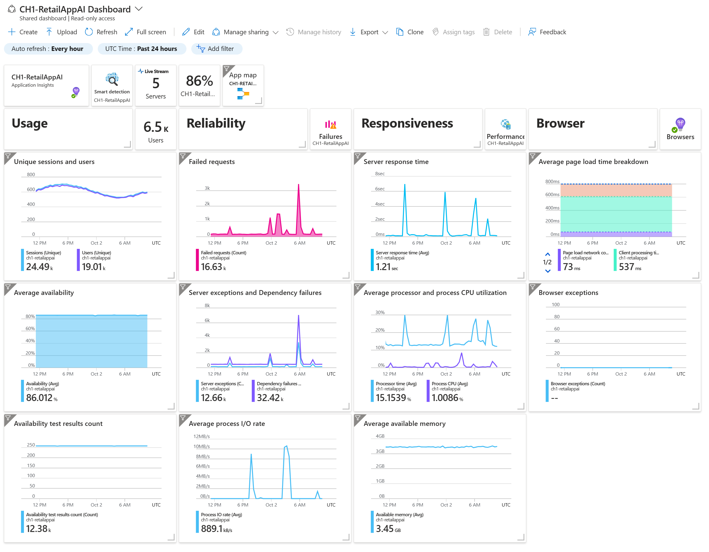
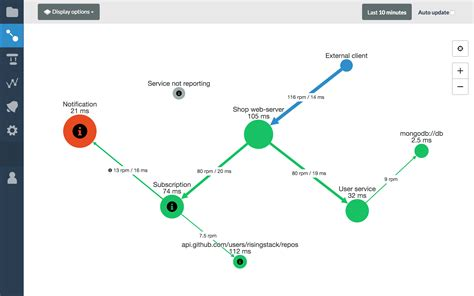
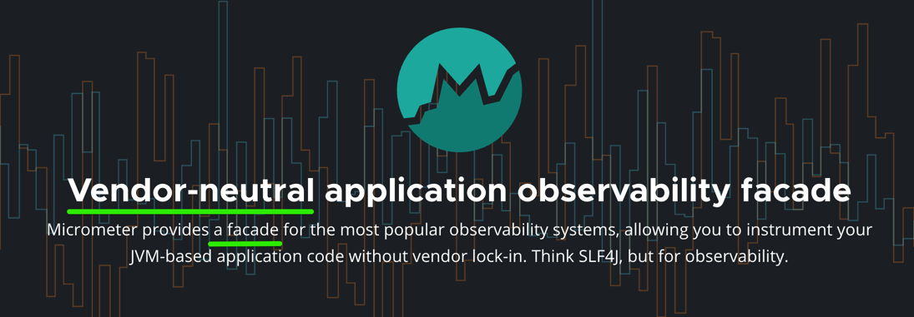
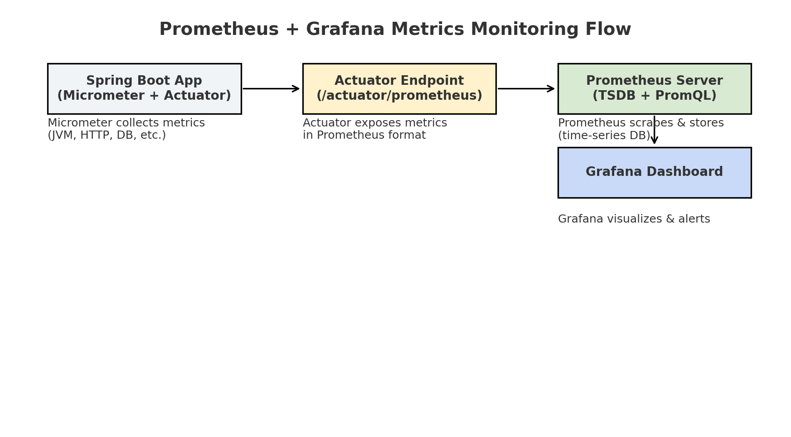
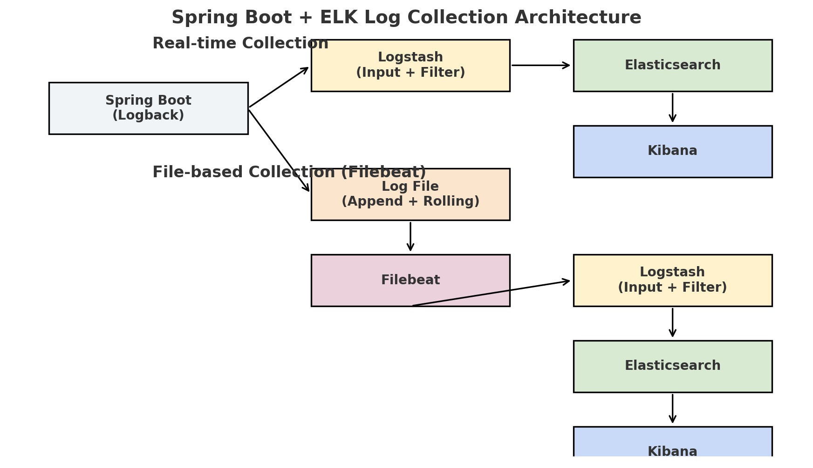

## **애플리케이션 모니터링의 3가지 종류 소개**

애플리케이션 모니터링의 핵심 축은 **로그 (Logs)**, **메트릭 (Metrics)**, **트레이싱 (Tracing)** 입니다. 이 세 가지는 단순히 데이터를 수집하는 수단이 아니라, 시스템의 상태를 관찰하고 문제를 진단하는 데 필수적인 요소입니다.

* **로그 (Logs)** 는 애플리케이션이 수행한 작업과 발생한 이벤트를 기록한 텍스트 데이터입니다. 오류 메시지, 사용자 요청 처리 결과, 내부 상태 변화 등을 시간 순으로 확인할 수 있어, 문제 원인을 세부적으로 분석하는 데 유용합니다.
 
 (출처: [https://docs.kublr.com/logging/logging-kibana/](https://docs.kublr.com/logging/logging-kibana/))
 
* **메트릭 (Metrics)** 은 CPU·메모리 사용량, 응답 시간, 처리 건수처럼 수치로 표현되는 데이터입니다. 시계열로 수집하여 추세를 파악하고, 성능 저하나 리소스 부족 같은 이상 징후를 빠르게 감지할 수 있습니다.
 
 (출처: [https://learn.microsoft.com/en-us/azure/azure-monitor/app/overview-dashboard?utm_source=chatgpt.com](https://learn.microsoft.com/en-us/azure/azure-monitor/app/overview-dashboard?utm_source=chatgpt.com))

* **트레이싱 (Tracing)** 은 하나의 요청이 애플리케이션 내부 또는 여러 서비스 사이를 어떻게 이동하는지를 추적합니다. 이를 통해 특정 구간의 지연이나 오류를 pinpoint할 수 있어, 마이크로서비스 환경에서 특히 중요합니다.

 (출처: [https://blog.risingstack.com/distributed-transaction-tracing-microservices-monitoring/](https://blog.risingstack.com/distributed-transaction-tracing-microservices-monitoring/))

이 세 가지는 함께 모여 **관측가능성 (Observability)** 의 핵심을 이룹니다. 메트릭으로 ‘무엇이’ 잘못됐는지 감지하고, 로그로 ‘왜’ 그런 일이 발생했는지 분석하며, 트레이싱으로 ‘어디서’ 문제가 생겼는지 정확히 찾을 수 있습니다. 결국 이 조합이 있어야 시스템을 깊이 이해하고, 장애 대응과 성능 최적화를 효율적으로 수행할 수 있습니다.

또한, APM (Application Performance Monitoring) 은 바로 이 세 가지 데이터를 종합해 애플리케이션의 성능과 동작 상태를 한눈에 보여주는 모니터링 방식입니다. 즉, 로그·메트릭·트레이싱이 각각의 센서라면, APM은 이를 묶어 전체 상황을 진단하는 종합 컨트롤 타워 역할을 합니다.

## **로그, 지표, 트레이싱 각각 모니터링을 위한 상용 기술 스택 소개**

모니터링 환경을 구축하려면 로그·지표·트레이싱 데이터를 효율적으로 수집하고 분석할 수 있는 도구가 필요합니다. 아래는 대표적인 오픈소스 중심의 기술 스택을 소개합니다.

1. **로그 (Logs)**

   * **ELK Stack**: Elasticsearch, Logstash, Kibana로 구성된 대표적인 로그 분석 스택입니다. 다양한 소스에서 로그를 수집(Logstash), 저장·검색(Elasticsearch), 시각화(Kibana)할 수 있습니다. 대규모 로그 데이터 처리와 강력한 검색 기능이 장점입니다.
   * **Loki + Grafana**: Grafana Labs에서 개발한 로그 수집·조회 시스템입니다. Prometheus와 유사한 인덱싱 구조를 사용해 운영 부담이 적고, Grafana 대시보드에서 메트릭과 로그를 함께 조회할 수 있어 통합 분석에 강합니다.

2. **지표 (Metrics)**

   * **Prometheus + Grafana**: Prometheus는 시계열 데이터 수집에 최적화된 모니터링 시스템이며, Grafana는 이를 시각화하고 알람을 설정할 수 있는 대시보드 도구입니다. Kubernetes 환경에서 사실상 표준으로 사용됩니다.
   * **TICK 스택**: Telegraf(수집), InfluxDB(저장), Chronograf(시각화), Kapacitor(알람)로 구성됩니다. InfluxDB의 빠른 시계열 데이터 처리 성능을 기반으로, IoT나 장기 데이터 분석 환경에서 강점을 발휘합니다.

3. **트레이싱 (Tracing)**

   * **Zipkin**: 경량 분산 트레이싱 도구로, 서비스 간 호출 관계와 각 구간의 지연 시간을 시각적으로 분석합니다. 설치와 운영이 간단하며, 마이크로서비스 구조에서 요청 흐름을 빠르게 파악할 수 있습니다.

이번 글에서는 로그 모니터링 기술 스택인 ELK와 지표 모니터링 기술 스택인 Prometheus + Grafana에 대해서 자세히 설명하겠습니다. 

**지표 모니터링 대표 기술인 Prometheus + Grafana의 동작원리**

Prometheus와 Grafana는 클라우드 네이티브 환경에서 가장 널리 쓰이는 지표 모니터링 조합입니다. Prometheus가 지표를 수집·저장하고, Grafana가 이를 시각화해 대시보드와 알람을 제공합니다. Spring Boot 애플리케이션에서는 이 과정에서 **Spring Boot Actuator**와 **Micrometer**가 중요한 역할을 합니다.

1. **Spring Boot Actuator와 Micrometer**

   * **Spring Boot Actuator**는 애플리케이션의 상태, 성능, 환경 정보 등을 노출하는 엔드포인트 모음입니다. 기본적으로 `/actuator/health`, `/actuator/info` 같은 운영 정보뿐 아니라, 메트릭도 노출할 수 있습니다.
   * Spring Boot 2.x 이상에서는 Actuator에 **Micrometer Core**가 포함돼 있어서, 별도로 Micrometer를 추가하지 않아도 기본적인 메트릭 수집이 가능합니다. 다만 Prometheus, InfluxDB 같은 특정 백엔드와 연동하려면 해당 **Registry 의존성**(예: `micrometer-registry-prometheus`)을 추가해야 합니다.
   * **Micrometer**는 애플리케이션의 지표를 계측·수집하는 라이브러리입니다. JVM 메모리, 스레드 수, HTTP 요청 처리 속도, DB 쿼리 시간 등 다양한 지표를 **Meter** 객체로 수집하고, 이를 Prometheus 등 외부 모니터링 시스템이 이해할 수 있는 포맷(OpenMetrics)으로 변환합니다.

 (출처: [https://micrometer.io/](https://micrometer.io/))

2. **내부 동작 원리**

   * **애플리케이션 내부**: Micrometer가 JVM, HTTP, DB 등 다양한 메트릭을 수집하고 `PrometheusMeterRegistry`에 등록합니다. Actuator는 `/actuator/prometheus` 엔드포인트를 통해 이 데이터를 외부에 노출합니다.
   * **Prometheus 서버**: Prometheus는 설정된 주기(기본 15초)마다 `/actuator/prometheus`에 **Pull 요청**을 보내 메트릭을 가져옵니다. 가져온 데이터는 시계열 DB에 저장되고, PromQL로 조회할 수 있습니다.
   * **Grafana**: Grafana는 Prometheus를 데이터 소스로 연결해 PromQL 쿼리를 실행하고, 그 결과를 시각화합니다. 이를 통해 대시보드, 게이지, 히트맵, 알람 등을 구성해 실시간으로 애플리케이션 상태를 모니터링할 수 있습니다.

결국, Micrometer는 지표를 **수집**하고, Actuator는 그 지표를 **노출**하며, Prometheus는 이를 **저장**, Grafana는 **시각화**하는 구조입니다. 이 네 가지가 조합되면 개발자와 운영자는 애플리케이션의 성능 상태를 빠르고 직관적으로 파악할 수 있습니다.

### 참고) **시계열 데이터베이스란 무엇인가? RDB와 차이점** 

시계열 데이터베이스(Time Series Database, TSDB)는 데이터의 변화 과정을 시간 순서대로 기록하고 분석하는 데 특화된 데이터베이스입니다. 각 데이터 포인트는 \*\*타임스탬프(시간 정보)\*\*를 중심으로 저장되며, 같은 지표 이름이라도 시각이 다르면 별도의 데이터로 취급됩니다. 이러한 특성 덕분에, 시스템 모니터링·IoT 센서 데이터·금융 시세 데이터처럼 시간에 따라 변하는 값을 다루는 데 최적화되어 있습니다.

TSDB의 기본 구조는 다음과 같습니다.

* **Metric Name**: 지표 이름 (예: `http_requests_total`)
* **Labels**: 메트릭의 속성을 설명하는 키-값 태그 (예: `method="GET"`, `status="200"`)
* **Timestamp**: 측정된 시각
* **Value**: 해당 시점의 측정값

**Prometheus** 같은 TSDB는 수집한 데이터를 먼저 \*\*WAL(Write Ahead Log)\*\*에 기록하고, 일정 기간(예: 2시간) 단위로 압축 블록에 저장합니다. 각 블록은 실제 값(Chunks), 라벨-시리즈 매핑(Index), 메타데이터(Meta)로 구성되어 조회와 압축에 최적화되어 있습니다.

전통적인 관계형 데이터베이스(RDB)와 비교하면 다음과 같은 차이가 있습니다.

| 구분     | TSDB                         | RDB                  |
| ------ | ---------------------------- | -------------------- |
| 데이터 모델 | 시간 + 값 + 라벨 중심               | 행(Row)과 열(Column) 중심 |
| 저장 방식  | Append-only, 시계열 압축 저장       | 트랜잭션 기반, CRUD 모두 지원  |
| 조회 언어  | PromQL, InfluxQL 등 시계열 전용 쿼리 | SQL                  |
| 인덱싱    | 라벨 기반 인덱스                   | 기본 키·보조 키 인덱스        |
| 목적     | 시간 흐름에 따른 변화 분석              | 범용 데이터 처리            |
| 장점     | 시간 기반 조회·집계 속도 최적화           | 데이터 무결성과 관계 모델링 강점   |

정리하자면, **RDB가 데이터의 정합성과 관계 모델링에 강점이 있다면, TSDB는 시간축에 따른 변화 추적과 대량의 시계열 데이터 저장·조회에 특화**돼 있습니다. 이런 이유로 TSDB는 모니터링, IoT, 금융 데이터 분석 등에서 핵심 인프라로 쓰입니다.

## **로그 모니터링의 대표 기술인 ELK의 동작원리**

ELK 스택(Elasticsearch, Logstash, Kibana)은 로그의 **수집 → 처리 → 저장 → 분석** 전 과정을 지원하는 대표적인 오픈소스 기술 조합입니다. Spring 애플리케이션 환경에서는 기본 로깅 프레임워크인 **Logback**과 연동해 로그를 수집하고 ELK로 전달합니다.

### **Spring 애플리케이션과 Logback 연동**

   * Spring Boot는 기본 로깅 구현체로 Logback을 사용합니다.
   * Logback은 로그를 콘솔이나 파일로 기록하는 것 외에도, **Appender**를 통해 네트워크 전송이 가능합니다.
   * ELK와 연동 시 주로 **Logstash TCP/UDP Appender** 또는 **Logstash Logback Encoder**를 사용해 로그 이벤트를 JSON 포맷으로 변환하고, Logstash로 직접 전송하거나 파일에 기록합니다.

### 1. **실시간 수집 방식**

   * Logback이 로그를 생성하면, 전용 Appender가 이를 JSON 포맷으로 변환해 \*\*Logstash Input 플러그인(TCP, UDP, HTTP 등)\*\*으로 직접 전송합니다.
   * Logstash는 필터 플러그인을 통해 필드를 파싱·정규화한 뒤 Elasticsearch에 색인합니다.
   * Kibana는 Elasticsearch 데이터를 시각화해, 실시간 로그 탐색과 대시보드를 제공합니다.
   * 장점: 실시간 분석 가능
   * 단점: 네트워크 부하와 장애에 민감

### 2. **파일 기반 수집 방식(Filebeat 사용)**

  * Logback이 로그를 파일에 **Append 모드**로 기록합니다(롤링 정책 적용 가능).
  * **Filebeat**가 해당 로그 파일을 tail 하듯 읽어 변경분만 전송합니다.
  * Filebeat는 직접 Elasticsearch로 전송하거나, Logstash로 보내 전처리 후 Elasticsearch에 저장합니다.
  * 장점: 네트워크 장애 시에도 로그 손실 위험이 적고, 애플리케이션 부하가 적음
  * 단점: 실시간성이 다소 떨어질 수 있음

정리하면, Spring 애플리케이션 로그는 **Logback → Logstash(또는 Filebeat) → Elasticsearch → Kibana** 흐름으로 처리됩니다. 실시간 전송은 빠른 분석에 유리하고, 파일 기반 수집은 안정성과 운영 부담 완화에 강점이 있어, 환경에 따라 두 방식을 혼합해서 쓰기도 합니다.

## 참고자료
* [https://docs.kublr.com/logging/logging-kibana/](https://docs.kublr.com/logging/logging-kibana/)
* [https://learn.microsoft.com/en-us/azure/azure-monitor/app/overview-dashboard?utm_source=chatgpt.com](https://learn.microsoft.com/en-us/azure/azure-monitor/app/overview-dashboard?utm_source=chatgpt.com)
